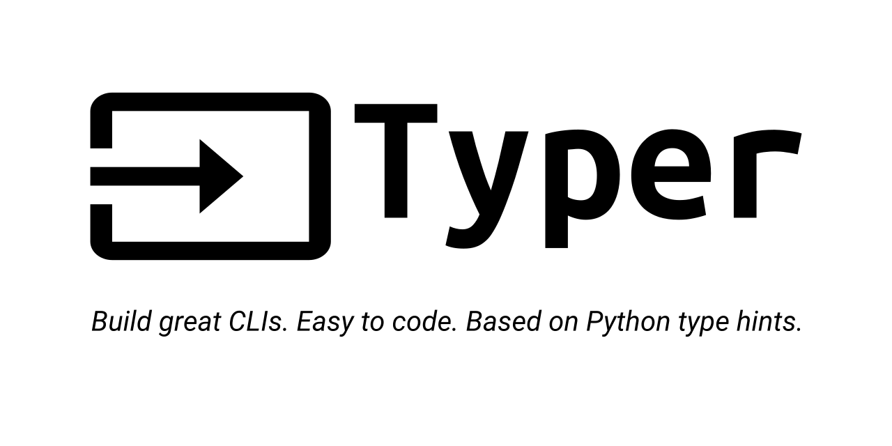

<p align="center">
  
</p>


*Language Transfer Flashcards (LTF) is a CLI tool designed to enhance your language learning experience by bridging the
gap between [Language Transfer's](https://www.languagetransfer.org/) audio lessons
and [Anki's](https://apps.ankiweb.net/) spaced repetition system. This project transforms the rich content of Language
Transfer YouTube lessons into easily digestible flashcards, allowing learners to reinforce their knowledge effectively.*


<p align="center">
	
	
	
    
</p>


<p align="center">
  <a href='#about-the-project'>About the Project</a> •
  <a href='#installation'>Installation</a> •
  <a href='#usage'>Usage</a> •
  <a href='#limitations'>Limitations</a> •
  <a href='#anki-csv-import'>Anki: CSV Import</a> •
  <a href='#next-steps'>Next Steps</a> •
  <a href='#contact'>Contact</a>
</p>


---

---

## About the Project

### Key Features

- **Automated Extraction:** Extracts words, phrases, and sentences with translations from Language Transfer YouTube
  lessons.
- **Anki Integration:** Generates CSV files ready for direct import into Anki, creating instant flashcard decks (OpenAI
  API key required).
- **Alternative Workflow:** Download a text file, containing the prompt and lesson transcript to use with your favorite
  LLM web interface (e.g., ChatGPT, Claude, etc.).

### Why it's Valuable?

- **Boost Learning Efficiency:** Combine Language Transfer's proven method with Anki's powerful spaced repetition.
- **Save Time:** Automate hours of manual flashcard creation.
- **Customizable:** Adapt to your preferred workflow, with or without API access.

### Build With

<p>
  
  <a href="https://www.python.org/">Python</a>
</p>

<p>
  
  <a href="https://github.com/langchain-ai/langchain">LangChain</a>
</p>

<p>
  
  <a href="https://github.com/tiangolo/typer">Typer</a>
</p>

## Installation

**Recommended:** Create and activate
a [virtual environment](https://docs.python.org/3/library/venv.html#creating-virtual-environments) before installing the
tool.

**Using pip**

``` bash
pip install language-transfer-flashcards
```

**Using poetry**

``` bash
poetry add language-transfer-flashcards
```

### Configuration with .env file [optional, but recommended]

Create a `.env` file in your home directory under `~/.ltf/.env` with the following variables:

``` properties
OPENAI_API_KEY=<YOUR_OPENAI_API_KEY>
OPENAI_MODEL_NAME=gpt-4o
TARGET_LANGUAGE=Swahili
```

Not sure where to create the .env file in your system?

``` bash
ltf env-location
```

To see all valid values for the variables `OPENAI_MODEL_NAME` and `TARGET_LANGUAGE`

``` bash
ltf csv --help
```

**Note:** The OpenAI-related variables are optional if you're not using the API.

## Usage

Create flashcards in CSV format - file will be saved in current working directory

``` bash
ltf csv https://www.youtube.com/watch?v=VIDEO_ID  # assumes .env file exists
```

Without the .env file, specify your target-language, the OpenAI model name and API key

``` bash
ltf csv https://www.youtube.com/watch?v=VIDEO_ID -l Swahili -m gpt-4o -k "YOUR_OPENAI_API_KEY"
```

**Important:** Find the YouTube URLs for all Language Transfer lessons [here](https://www.youtube.com/@LanguageTransfer/playlists).

### Usage without using the OpenAI API

Download the full prompt which is used to extract the content of the language lesson in a txt file.

``` bash
ltf prompt https://www.youtube.com/watch?v=VIDEO_ID  # assumes .env file exists
```

If there is no .env file, add your target-language to the command, for example: `-l Swahili`

**Manual Processing**

- Copy the downloaded content into your favorite LLM web interface - recommended: [ChatGPT](https://chatgpt.com/)
  or [Claude](https://claude.ai/new).
- The output will be the content of the lesson in CSV format -> English, Translation.
- Copy the output into a text editor and create a CSV file
- Import the CSV file into Anki

## Limitations

- **AI Imperfections:** LLMs may occasionally produce inaccurate translations or misinterpret context.
- **Transcript Quality:** YouTube's auto-generated transcripts can contain errors.
- **Content Discrepancies:** Flashcards may sometimes differ from the exact lesson content due to transcript and AI
  limitations. Review your final flashcards before importing them into Anki.
- **Technical Requirements:** Basic command-line knowledge is needed.
- **API Costs:**
    - gpt-4o: ~$0.01 per lesson
    - gpt-4o-mini: < $0.0005 per lesson

## Anki: CSV Import

1. Open Anki
2. Create or select a deck for your target language
3. Navigate to `File` > `Import`
4. Select your generated CSV file for upload
5. Select the correct seperator for your CSV file, configure `Import options` and click on `Import`

## Roadmap

- [x] Publish on PyPI
- [ ] Add support for other LLMs (including Ollama)
- [ ] Create a web-based interface for non-technical users

## Contact

- **Website:** Coming Soon
- **Email:** tendai.charura@gmail.com
- **GitHub:** [t-charura](https://github.com/t-charura)
